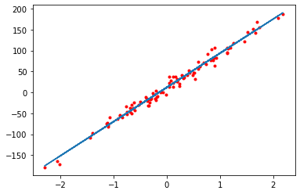

# Linear Regresion

Here we can see an example of things we have learned until now. first, we generate data from *sklearn* library and then we train a linear model using *pytorch*:

```python
import torch
import numpy
import matplotlib.pyplot as plt
from sklearn import datasets

# ------------ data generator -------------
X_numpy, Y_numpy = datasets.make_regression(n_samples=100, n_features=1, bias=10, noise=10, random_state=1)

X = torch.from_numpy(X_numpy.astype(numpy.float32))
Y = torch.from_numpy(Y_numpy.astype(numpy.float32))

X = X.view(-1, 1)
Y = Y.view(-1, 1)

# ------------ training ------------------
model = torch.nn.Linear(in_features=1, out_features=1)

loss = torch.nn.MSELoss()

optimizer = torch.optim.SGD(model.parameters(), lr=0.01)

iter_num = 1000
for iter in range(iter_num):
    Y_pred = model(X)

    Loss = loss(Y_pred, Y)

    Loss.backward()

    optimizer.step()

    optimizer.zero_grad()

    if iter % (iter_num/10) == 0:
        [w, b] = model.parameters()
        print("epoch %i: w = %f, b = %f, loss = %f" % (iter+1, w, b, Loss))

Y_pred = model(X).detach()

plt.plot(X, Y, 'r.')
plt.plot(X, Y_pred)
```

Here is the result:

